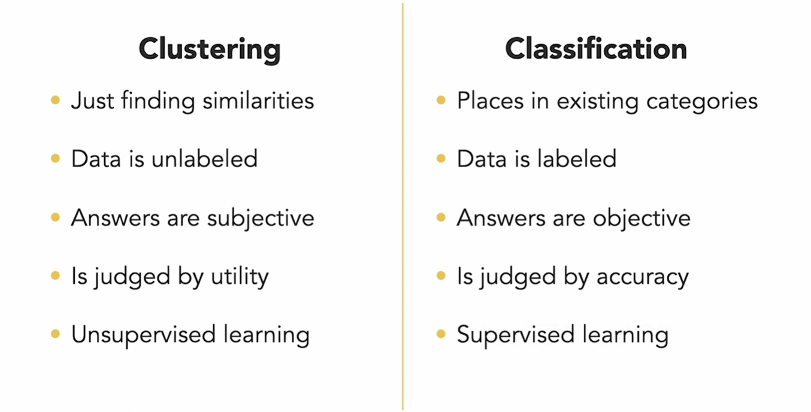

# Data Mining in Python - LinkedIn Learning

This repo was created while following along with LinkedIn Learning certification program [Data Science Foundations: Data Mining in Python](https://www.linkedin.com/learning/data-science-foundations-data-mining-in-python/the-crisp-dm-data-mining-model?autoAdvance=true&autoSkip=true&autoplay=true&resume=false), taught by [Barton Poulson](https://www.linkedin.com/learning/instructors/barton-poulson).

# Course Details:
>Data mining is the area of data science that focuses on finding actionable patterns in large and diverse datasets: clusters of similar customers, trends over time that can only be spotted after disentangling seasonal and random effects, and new methods for predicting important outcomes. In this course, instructor Barton Poulson introduces you to data mining that uses the programming language Python. Barton goes over some preliminaries, such as the tools you may use for data mining. He discusses aspects of dimensionality reduction, then explains clustering, including hierarchical clustering, k-Means, DBSCAN, and more. Barton covers classification, including kNN and decision trees. He goes into association analysis and introduces you to Apriori, Eclat, and FP-Growth. Barton steps you through a time-series decomposition, then concludes with sentiment scoring and other text mining tools.

# Skills Covered
* [Python (Programming Language)](https://www.linkedin.com/learning/search?keywords=Python%20(Programming%20Language))
* [Data Mining](https://www.linkedin.com/learning/search?keywords=Data%20Mining)

# Chapters
* [Dimentionality Reduction (A)](#Dimentionality "Goto **Dimentionality Reduction**")
* [Clustering (B)](#Clustering "Goto **Clustering**")
* [Classification (C)](#Classification "Goto **Classification**")
* [Association Analysis (D)](#Association "Goto **Association Analysis**")
* [Time-Series Mining (E)](#Time-Series "Goto **Time-Series Mining**")
* [Text Mining (F)](#Text "Goto **Text Mining**")

# Key Slides:
## **The CRISP-DM data mining model (CRoss Industry Standard Process for Data Mining)**

## **Validating Results**

## **Dimensionality Reduction**

## **Clustering**

## **Classification**

## **Association Analysis**

